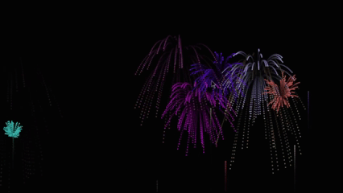

## Fireworks Simulator

MonoGame C# application running on .NET 8.0

An interactive fireworks display simulator featuring particle physics, gravity effects, and customizable explosion patterns.

### Softwares/Libraries used

- Visual Studio 2022
- .NET 8.0 SDK
- MonoGame Framework

### Building the Project
1. Clone this repository from the **GitHub repository**
2. Open the solution in Visual Studio 2022
3. Build the solution & run it

### Running the Application

**Option 2: Download from GitHub Actions**
1. Go to this GitHub repository
2. Click on the **Actions** tab
3. Select the latest successful workflow run
4. Scroll down to the **Artifacts** section
5. Download the `build-release` artifact
6. Unzip and run `FireworksSimulator.exe`

## Controls

- **Space**: Launch a firework
- **Left Click**: Create a particle at cursor position
- **Right Click**: Add a rectangle shape
- **Middle Click**: Clear all shapes
- **Escape**: Exit application

## Features

- Realistic particle physics with gravity
- Randomized firework colors and explosion patterns
- Fade trail effects for visual appeal
- Resizable window with proper aspect ratio scaling
- 60-100 particles per explosion
- Dark night sky background

## Testing

Unit tests are included in the `FireworksTests` and `ShapeLibraryTests` projects.  
Run tests using Visual Studio Test Explorer or through GitHub Actions.

## Credits

Made by Andy Ionita, 2333068  
Programming IV, Dirk Dubois, Section 1
